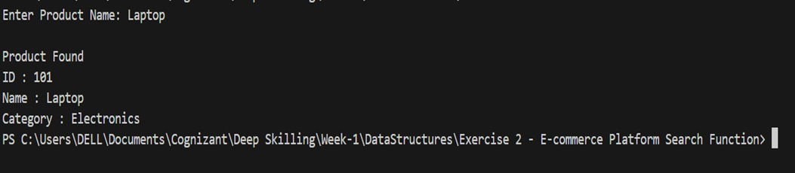

# Exercise 2: E-commerce Platform Search Function

## Scenario

An e-commerce platform stores information about different products. When a customer searches for a product using its ID, the system should check whether the product is available and display its details.

---

## Objective

The objective of this exercise is to implement the **Linear Search** algorithm to search for a product from a list of products.

---

## About the Concept

Linear Search is one of the simplest searching techniques. It checks each element one by one until the required element is found or until the end of the list is reached. It works well for small datasets and does not require the data to be sorted.

---

## How the Program Works

- Create a list of products with product ID, product name, and category.
- Read the product ID entered by the user.
- Compare the entered ID with each product in the list.
- If a match is found, display the product details.
- If no match is found, display an appropriate message.

---

## Advantages

- Easy to understand and implement.
- Works with both sorted and unsorted data.
- Suitable for small collections of data.

---

## Limitations

- Not efficient for large datasets.
- Each element is checked one by one in the worst case.
- Slower compared to Binary Search when the data is sorted.

---

## Time Complexity

| Case | Complexity |
|------|------------|
| Best Case | O(1) |
| Average Case | O(n) |
| Worst Case | O(n) |

---

## Space Complexity

**O(1)** because no additional memory is required apart from a few variables.

---

## Files Included

- Product.cs
- Search.cs
- Program.cs

---

## Output

---

## What I Learned

- I understood how the Linear Search algorithm works.
- I learned how to search for an object in an array using a key value.
- I gained hands-on experience in implementing searching techniques using C#.
- I understood the time complexity of Linear Search and when it is suitable to use.
