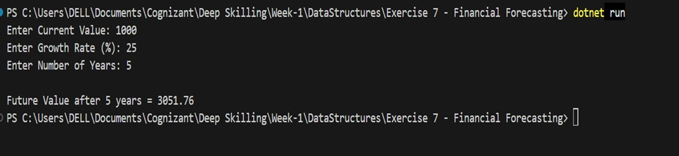

# Exercise 7: Financial Forecasting

## Part 1: Understanding Financial Forecasting

### What is Financial Forecasting?

Financial forecasting is the process of estimating future financial values based on historical data and a fixed growth rate. It helps organizations predict future revenue, profits, investments, and expenses, making it easier to plan business strategies and allocate resources effectively.

In this exercise, recursion is used to calculate the future value by repeatedly applying the growth rate for each forecast period.

---

## Recursive Approach

A recursive function solves the problem by calling itself with a smaller input until it reaches a stopping condition.

### Components of Recursion

**Base Case**
- Stops the recursive calls when the required number of years reaches zero.

**Recursive Case**
- Calculates the next year's value by applying the growth rate and calls the same function again for the remaining years.

---

## Advantages

- Simple and easy to understand for repetitive calculations.
- Reduces code complexity for recursive problems.
- Suitable for forecasting values over multiple periods.

---

## Limitations

- Uses additional memory because every recursive call is stored in the call stack.
- Can become inefficient for a large number of recursive calls.
- Deep recursion may lead to a stack overflow.

---

## Time Complexity

The recursive solution performs one recursive call for each forecasting period.

**Time Complexity:** `O(n)`

---

## Space Complexity

The recursive call stack stores one function call for each year.

**Space Complexity:** `O(n)`

---

## Possible Improvements

The performance of the forecasting algorithm can be improved by:

- Using an iterative approach instead of recursion.
- Applying Dynamic Programming to avoid repeated calculations.
- Using Memoization to store previously computed values.

These approaches reduce execution time and improve memory efficiency for large datasets.

---

## Output

