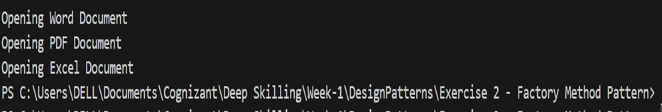

# Exercise 2: Implementing the Factory Method Pattern

## Scenario

A document management system needs to create different types of documents such as Word, PDF, and Excel. Instead of creating these objects directly, a factory is used to generate the required document.

---

## Objective

The objective of this exercise is to implement the **Factory Method Design Pattern** to create different document objects without exposing the object creation logic.

---

## About the Concept

The Factory Method Pattern is a creational design pattern that creates objects through a factory class instead of directly using the `new` keyword. This makes the application easier to extend and maintain.

---

## How the Program Works

- A common document interface or abstract class is created.
- Different document classes inherit from the base class.
- A factory class creates the required document object.
- The client requests the object from the factory instead of creating it directly.

---

## Advantages

- Reduces dependency between classes.
- Makes the code easier to maintain.
- New document types can be added with minimal changes.

---

## Output

---

## What I Learned

- I understood how the Factory Method Pattern separates object creation from object usage.
- I learned how factories make applications more flexible.
- I gained practical experience in implementing a creational design pattern using C#.
